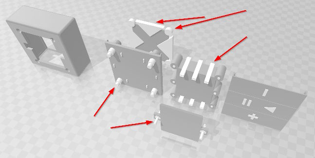

# Infos zum Druck

In diesem Ordner findest du alle 3D-Dateien für das Gehäuse:

- **`remote.3mf`** — enthält alle Komponenten; das Modell wurde mit Microsoft 3D Builder erstellt. **Wichtiger Hinweis:** Alle **"weißen" Objekte** müssen vor dem Export bzw. Druck **subtrahiert** (Boolean/Difference) werden, da sie als Platzhalter/Schnitt-Objekte dienen.
- **Einzelteile / STLs** — zusätzlich liegen die Einzeldateien als STL-Exporte vor (z. B. `Baseplate.stl`, `BatteryDeckel.stl`, `Buttons.stl`, `Abdeckplatte.stl`) und können verwendet werden, wenn keine weiteren Anpassungen nötig sind.

### 3D-Druck

Für meine Fernbedienung habe ich alle Teile mit folgenden Settings gedruckt: 
- Schichthöhe: **0.2 mm** 
- Infill: **25 %**

