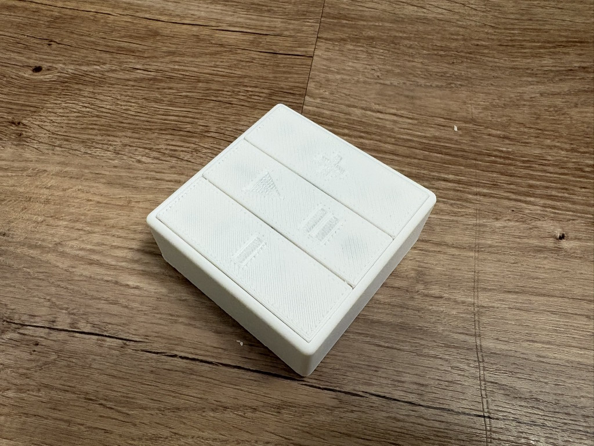
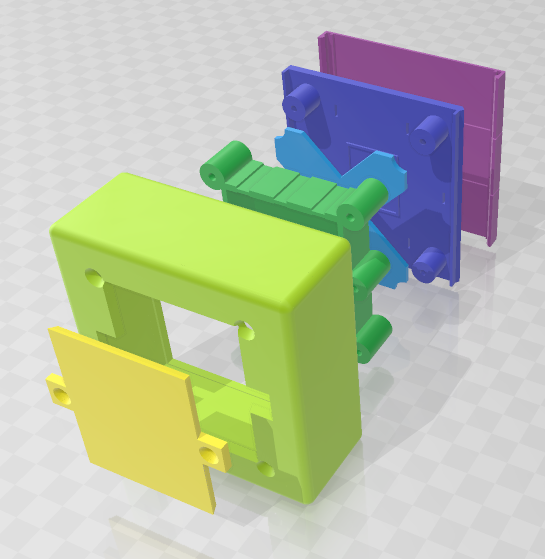
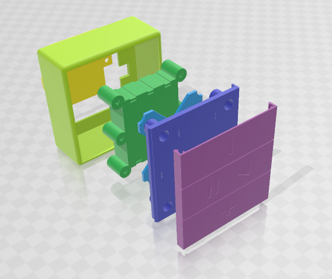
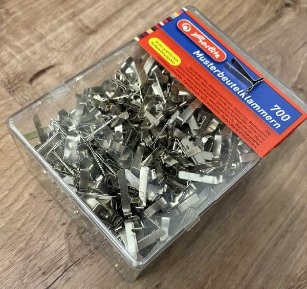

# sonosRemote
simple hardware remote control for my sonos speaker





# ESP32 ⚙️ Funktionen

- **3 Taster** für Lauter, Play/Pause, Leiser
- **Deep Sleep** im Ruhezustand (<0.1 mA)
- **Wake-up per GPIO** (Tasterdruck auf Lauter)
- **60 Sekunden Aktiv-Zeit** vor erneutem Schlaf
- **WLAN-Verbindung** zu Sonos-Lautsprecher
- **mDNS-Unterstützung** (z. B. `http://sonosremote.local`)
- **Arduino OTA** für Over-the-Air-Updates

---

## 💡 LED Statusanzeige

Die eingebaute LED zeigt verschiedene Gerätezustände an:

| Zustand | LED-Muster | Bedeutung |
|---------|------------|-----------|
| Startphase | 0,1s an / 0,15s aus | WLAN-Verbindungsaufbau läuft |
| Tastendruck | 0,5s an | Bestätigung der Tasteneingabe |
| Aktiv-Wartemodus | 0,1s an / 0,4s aus | Gerät ist aktiv, wartet auf Befehle/OTA |
| Deep Sleep | LED aus | Gerät im Stromsparmodus |

Die LED-Zeiten können über Konstanten in `sonos.ino` angepasst werden:
```cpp
#define LED_STARTUP_ON_MS   100  // LED an während Start
#define LED_STARTUP_OFF_MS  150  // LED aus während Start
#define LED_FEEDBACK_MS     500  // Tastendruckbestätigung
#define LED_IDLE_ON_MS      100  // LED an im Wartezustand
#define LED_IDLE_OFF_MS     400  // LED aus im Wartezustand
```

---

## 🔧 Hardwareit Deep Sleep, OTA & mDNS

## 🎯 Ziel

Ein ESP32-Sketch, der sich per WLAN verbindet, drei Taster ausliest und bei Tastendruck einen definierten Sonos-Lautsprecher steuert.  
Das System ist stromsparend durch Deep Sleep, unterstützt mDNS und Arduino OTA.

---

## 🔧 Benötigte Komponenten

| Komponente | Bild
|-------------|------- |
| ESP32C3 Supermini |
| Akku - 3× 1.2 V NiMH (3.6 V gesamt) |
| Musterbeutelklammern für die elektrischen Kontakte an der Batterie | 
| Ein paar kleine Kabel |
| etwas Alufolie als Kontaktschalter auf der Unterseite der Knöpfe |
| Sonos Lautsprecher - WLAN-fähig, im gleichen Netz |

---

## 🧱 Gehäuse & 3D-Dateien

Im Ordner `3d/` befinden sich **alle nötigen 3D-Dateien** für das Gehäuse:

- Die Datei `remote.3mf` enthält **alle Komponenten** zusammen; **alle "weißen" Objekte müssen subtrahiert werden**, bevor die Teile zusammengesetzt bzw. gedruckt werden.
- Zusätzlich gibt es die Einzelteile als `*.stl`-Dateien (z. B. `Baseplate.3mf`, `BatteryHolder.3mf`, `Buttons.3mf`).

> **Tipp:** Öffne `remote.3mf` in deinem 3D-Programm, führe die Subtraktion der weißen Objekte aus und exportiere bei Bedarf einzelne STL-Dateien für den Druck. 🔧

---

## ⚠️ WLAN-Einstellungen

Die **WLAN-Einstellungen (SSID, Passwort, evtl. statische IP)** befinden sich in `sonos/settings.h`. **Ändere dort die Werte vor dem ersten Flashen des Geräts.**

---

## 💻 Bibliotheken

- `WiFi.h`
- `SonosUPnP.h` ([javos65/Sonos-ESP32](https://github.com/javos65/Sonos-ESP32))
- `ArduinoOTA.h`
- `ESPmDNS.h`

---

## 🔋 Energieverbrauch & Laufzeit

| Zustand | Strom | Dauer/Tag | Verbrauch |
|----------|--------|------------|------------|
| Deep Sleep | 0.08 mA | 23 h 50 min | 2 mAh |
| Aktiv (WLAN, OTA-fähig) | 90 mA | 10 s × 100 | 25 mAh |
| **Gesamt** | | | **≈ 27 mAh/Tag** |

Mit 1200 mAh Akku: **ca. 44 Tage Laufzeit** bei 100 Betätigungen/Tag  
→ bei geringerer Nutzung: **mehrere Monate Laufzeit**.

---

## 🧠 Ablauf

1. **Deep Sleep:** ESP32 schläft mit nur RTC aktiv (0.05–0.1 mA).  
2. **Tastendruck:** weckt ESP32 (Wake-on-GPIO).  
3. **WLAN-Verbindung:** Aufbau (~1–2 s).  
4. **Sonos-Befehl:** Lauter, Leiser oder Play/Pause.  
5. **OTA/mDNS aktiv:** 60 s lang erreichbar.  
6. **Automatisch zurück in Deep Sleep.**

---

## 💡 Tipps

- OTA funktioniert **nur während der Aktivzeit (60 s)**.  
  → Taste drücken, dann OTA-Upload starten.  
- mDNS erlaubt Zugriff via `http://sonosremote.local` oder Ping.  
- Aktivzeit anpassen über:
  ```cpp
  const uint64_t AUTO_SLEEP_AFTER_MS = 60000; // 10 Sekunden
  ```

---


## ✅ Vorteile

- Extrem stromsparend
- schnelle Reaktion (<2 s)
- OTA & mDNS ohne Kabel
- Ideal für Akkubetrieb

---
